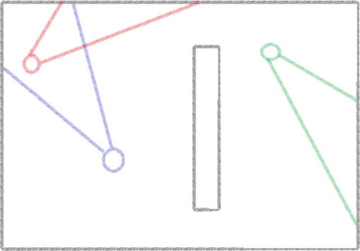

# Darkroom
## Концепция
Шутер с ограниченной зоной видимости. Чтобы победить игрок должен не только смотреть на экран, но и прислушиваться к звукам (выстрелы, шаги). Цель игры - уничтожить как можно больше противников за заданное время. В роли противников выступают боты.

## План работ
* ### Неделя 1
  Создание игровой карты. Реализация классов игрового мира и игроков.

  **Что было сделано:**
  * Создана модель игрока и соответствующие тесты.
  * Создана модель игровой карты, метод, генерирующий случайную карту, и соответствующие тесты.
  * Создана модель игрового мира, объединяющая другие модели.
  * Реализована отрисовка игровой карты и игроков.

* ### Неделя 2
  Реализация ограниченного обзора и управления игроком. Добавление звуков шагов.
  
  **Что было сделано:**
  * Создана модель геометрического полигона и соответствующие тесты.
  * Создана модель поля зрения игрока и соответствующие тесты.
  * Реализована отрисовка поля зрения игрока.
  * Реализовано перемещение игрока на клавиши WASD.
  * Реализован поворот камеры игрока на стрелочки влево и вправо.
  * Обновлен стиль и цветовая гамма игры.
  * Дополнены тесты модели игровой карты и игрока.

* ### Неделя 3
  Реализация оружия: добавление регистрации попаданий, звуков выстрелов.

  **Что было сделано:**
  * Создана модель пули и соответствующие тесты.
  * Создан обработчик полета пули и и соответствующие тесты.
  * Реализована стрельба на стрелочку вверх.
  * Игроки видны только если попадают в поле зрения.
  * Добавлен debug режим на клавишу ~.
  * Добавлены звуки выстрелов и хотьбы, громкость которых зависит от расстояния до источника звука.

* ### Неделя 4
  Реализация ботов: патрулирование карты, реакция на звуки.
* ### Неделя 5
  Добавление меню паузы, подсчета очков, времени игры, подсказок по управлению.
