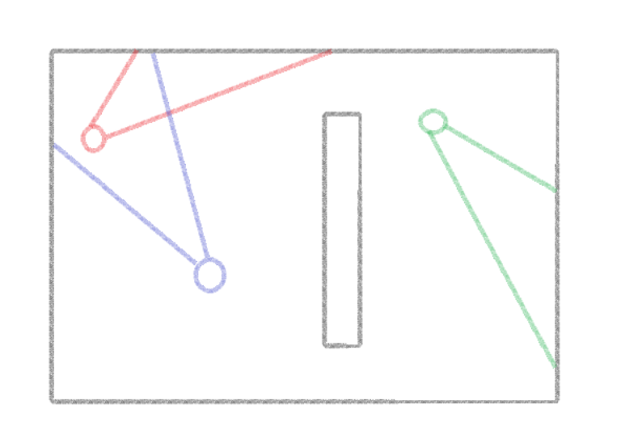

# Darkroom
## Концепция
Шутер с ограниченной зоной видимости. Чтобы победить игрок должен не только смотреть на экран, но и прислушиваться к звукам (выстрелы, шаги). Цель игры - уничтожить как можно больше противников за заданное время. В роли противников выступают боты.

## План работ
* ### Неделя 1
  Создание игровой карты. Реализация классов игрового мира и игроков.
* ### Неделя 2
  Реализация ограниченного обзора и управления игроком. Добавление звуков шагов.
* ### Неделя 3
  Реализация оружия: добавление регистрации попаданий, звуков выстрелов.
* ### Неделя 4
  Реализация ботов: патрулирование карты, реакция на звуки.
* ### Неделя 5
  Добавление меню паузы, подсчета очков, времени игры, подсказок по управлению.
